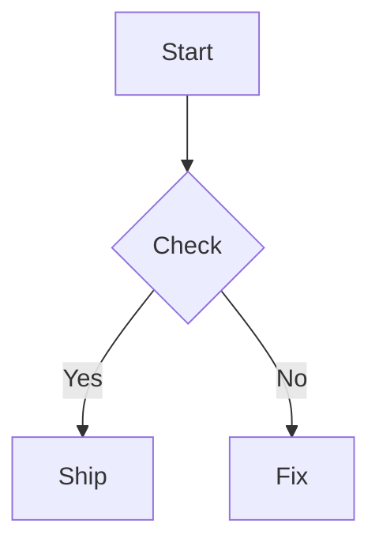

# Mermaid Feature

Mermaid 图表支持 Feature。

- 语法：使用围栏代码块：

````markdown

````

- AST：统一解析为 `diagram` 节点，`engine` 为 `mermaid`。
- 渲染：通过统一图表子系统生成 SVG。Web 端使用 `@supramark/web-diagram`，RN 端由 `@supramark/rn` 直接在本地调用 `beautiful-mermaid` 生成 SVG。

本包当前主要用于：

- 在 FeatureRegistry 中声明「Mermaid 图表」能力；
- 通过 `createMermaidFeatureConfig()` 为运行时配置提供强类型入口；
- 让 Web / RN 的 diagram gating 能和其它 family 使用同一套规则。
